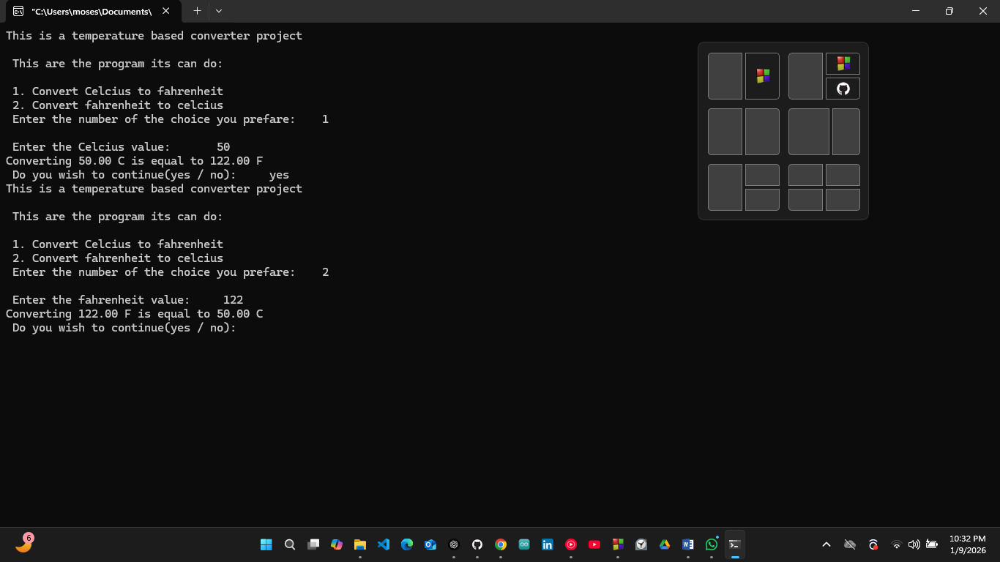

# Temperature Conversion Header – C Project

## Overview
This project is about using header files in C.
I made a program to convert temperatures between Celsius and Fahrenheit. 
I used a header file so the functions can be reused in other projects.

## Project Description
- I made a simple temperature converter.
- The main file asks the user for input and shows a menu.
- The header file has the function declarations.
- The source file has the functions that do the calculation.
- The program asks the user which conversion they want. Then it asks for a temperature.
- It prints the converted value. It can also repeat if the user wants.

## Project Structure
- main.c → handles user input, menu, and loop [Click Here For the code](Source_Code/main.c)
- temp_convert.h → has the function declarations [Click Here For the Code](Header_File/temp_convert.h)
- temp_convert.c → has the calculation functions [Click Here For the Code](Source_Code/temp_convert.c)

## Why Header Files
I used header files so I can reuse the functions later in other projects. The #ifndef / #define / #endif makes sure the header is not included more than once.

## How the Code Works
- Program starts from main()
- Libraries and header file are included
- Shows a menu: Celsius → Fahrenheit or Fahrenheit → Celsius
- User picks an option
- User enters a temperature
- Main calls the correct function from the source file
- Function does the calculation and prints the result
- Program asks if the user wants to continue
- If yes, repeats. If no, ends

## What I Learned
- How header files work in C
- How to split code into main, header, and source files
- How to make reusable functions
- How to use include guards
- How to take input and repeat program

## Images / Demo Video

[Click Here for the Demostration Video](videos/Temperature_Conversion_Header_project_on_9th_January_2025.mp4)

## Embedded Systems Connection
Header files are useful in embedded systems too. For example, a temperature sensor project can use these functions to convert values. Can be used in thermostats, fans, or even in weather systems.
